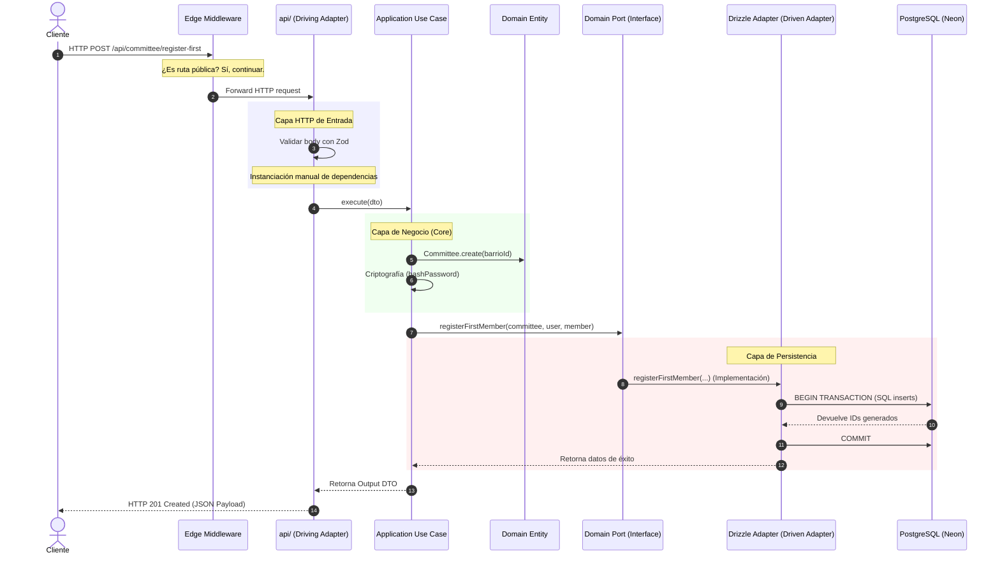

# 🏛️ Documentación de Arquitectura de Backend, Middleware y APIs

Este documento constituye la fuente oficial de verdad técnica para los desarrolladores y arquitectos que trabajan en el backend de la plataforma. Describe detalladamente el flujo de peticiones, las políticas de seguridad en el Edge, el catálogo de APIs, el núcleo del dominio y las tecnologías empleadas.

---

## 👁️ Resumen del Paradigma Arquitectónico

El backend está diseñado bajo los principios de **Clean Architecture**, **Hexagonal Architecture (Ports & Adapters)** y **Screaming Architecture**, desplegado sobre una infraestructura serverless en **Vercel**.

```mermaid
graph TD
    Client[Cliente HTTP] -->|1. Petición HTTP| EdgeMiddleware[Edge Middleware Global]
    EdgeMiddleware -->|2. Bloqueo 401 / Enrutamiento / Inyección Cabeceras| PrimaryAdapter[Driving Adapters: api/*]
    
    subgraph Capa de Entrada (Infraestructura HTTP)
        PrimaryAdapter
    end

    subgraph Núcleo de la Aplicación (Dominio y Aplicación)
        UseCase[Use Cases: src/*/application/*]
        Entities[Domain Entities: src/*/domain/entities/*]
        Ports[Outbound Ports / Interfaces: src/*/domain/repositories/*]
    end

    subgraph Capa de Persistencia y Salida (Driven Adapters)
        SecondaryAdapter[Drizzle Repositories: src/*/infrastructure/*]
        DB[(Base de Datos Postgres - Neon)]
    end

    PrimaryAdapter -->|3. Validación Zod & DTO| UseCase
    UseCase -->|4. Aplica Reglas| Entities
    UseCase -->|5. Consulta/Guarda| Ports
    Ports -.->|6. Implementa| SecondaryAdapter
    SecondaryAdapter -->|7. SQL Queries| DB
```

> [!IMPORTANT]
> **Independencia de Frameworks (Vendor Lock-in):** 
> La lógica de negocio (`src/`) es agnóstica de Vercel, Express, Fastify o cualquier framework HTTP. Todo el intercambio con el exterior se realiza a través de **Puertos** (interfaces) y la comunicación inicial con el protocolo HTTP está aislada en la carpeta `api/` (nuestros adaptadores primarios).

---

## 🔒 1. Middleware de Autenticación Global Edge (`middleware.ts`)

Ubicado en la raíz del backend ([middleware.ts](file:///home/joel/Proyectos%20Full-Stack/reports/backend/middleware.ts)), es una función **Vercel Edge Middleware** que intercepta todas las solicitudes antes de que toquen el backend serverless.

### Características Clave:
1. **Ejecución en el Edge:** Al correr en la red global de Vercel de manera distribuida, mitiga cold starts y no consume tiempo de cómputo ni conexiones de base de datos de las funciones de Node.js principales.
2. **Validación JWT Liviana:** Utiliza la librería `jose` (diseñada específicamente para entornos Edge) para verificar la firma criptográfica del token usando la variable `JWT_SECRET`.
3. **Inyección de Contexto:** Una vez validado el token, el middleware inyecta los datos de identidad en cabeceras HTTP específicas para que los handlers downstream puedan extraerlos con facilidad y seguridad:
   * `x-user-id`: Identificador único del usuario (almacenado en la propiedad `sub` del payload).
   * `x-user-role`: Rol del usuario en el sistema.
   * `x-user-barrio-id`: ID del barrio al cual pertenece el usuario.

### Rutas Públicas Excluidas (`PUBLIC_PATHS`):
El middleware omite la validación de tokens únicamente en las siguientes rutas públicas:
* `/api/health` - Chequeo de salud del servicio.
* `/api/auth/login` - Inicio de sesión.
* `/api/auth/register` - Registro inicial.
* `/api/committee/register-first` - Fundación del primer comité barrial.

> [!WARNING]
> Cualquier nueva ruta protegida debe **NO** ser agregada a esta lista. Si un endpoint requiere autenticación y no cuenta con las cabeceras inyectadas por el middleware, se lanzará una excepción interna de seguridad y un estado HTTP `500 Internal Server Error` (para evitar accesos inseguros por mala configuración).

---

## 🌐 2. Catálogo de APIs (Driving Adapters)

Los controladores HTTP residen en la carpeta [api/](file:///home/joel/Proyectos%20Full-Stack/reports/backend/api/). Cada archivo `.ts` representa una Vercel Serverless Function independiente.

### 2.1. Autenticación

#### **POST** `/api/auth/login`
* **Archivo:** [api/auth/login.ts](file:///home/joel/Proyectos%20Full-Stack/reports/backend/api/auth/login.ts)
* **Acceso:** Público.
* **Descripción:** Permite a los usuarios (vecinos, líderes) iniciar sesión y obtener un token JWT firmado.
* **Validación de Entrada (Zod):**
  ```typescript
  export const LoginSchema = z.object({
    usuario: z.string().min(3).max(50),
    contrasena: z.string().min(6),
  });
  ```
* **Respuestas Comunes:**
  * `200 OK`: Autenticación exitosa. Retorna el token y datos seguros del perfil de usuario.
  * `400 Bad Request`: Payload corrupto o campos faltantes (detalla los problemas de validación).
  * `401 Unauthorized`: Usuario no existe o contraseña incorrecta.

#### **GET** `/api/auth/me`
* **Archivo:** [api/auth/me.ts](file:///home/joel/Proyectos%20Full-Stack/reports/backend/api/auth/me.ts)
* **Acceso:** Protegido (Requiere cabecera `Authorization: Bearer <token>`).
* **Descripción:** Recupera los datos de perfil detallados del usuario que inició la sesión actual.
* **Flujo Interno:**
  1. Extrae el contexto del usuario (`userId`) usando el helper `getAuthenticatedUser(request)` de las cabeceras inyectadas por el Edge Middleware.
  2. Llama al caso de uso [GetProfileUseCase](file:///home/joel/Proyectos%20Full-Stack/reports/backend/src/authentication/application/use-cases/GetProfileUseCase.ts).
* **Respuestas Comunes:**
  * `200 OK`: Perfil de usuario recuperado con éxito.
  * `404 Not Found`: El usuario ya no existe en el sistema.
  * `401 Unauthorized`: Token ausente, expirado o corrupto.

---

### 2.2. Comités Barriales

#### **POST** `/api/committee/register-first`
* **Archivo:** [api/committee/register-first.ts](file:///home/joel/Proyectos%20Full-Stack/reports/backend/api/committee/register-first.ts)
* **Acceso:** Público.
* **Descripción:** Permite fundar un comité barrial en un barrio específico y registrar al primer miembro del comité con el rol de **Presidente** (además de crear su cuenta de usuario con rol "Lider" en el sistema general).
* **Validación de Entrada (Zod):**
  ```typescript
  export const RegisterFirstMemberSchema = z.object({
    barrioId: z.number().int().positive(),
    nombre: z.string().min(3).max(100),
    usuario: z.string().min(3).max(50),
    contrasena: z.string().min(6),
  });
  ```
* **Respuestas Comunes:**
  * `201 Created`: Comité registrado con éxito. Retorna `comiteId`, `usuarioId`, y `miembroId`.
  * `400 Bad Request`: Datos de entrada inválidos.
  * `404 Not Found`: El `barrioId` proporcionado no existe en el catálogo de territorios.
  * `409 Conflict`: Ya existe un comité registrado para ese barrio, o el `usuario` ya está en uso.

---

### 2.3. Salud e Infraestructura

#### **GET** `/api/health`
* **Archivo:** [api/health.ts](file:///home/joel/Proyectos%20Full-Stack/reports/backend/api/health.ts)
* **Acceso:** Público.
* **Descripción:** Monitorea la disponibilidad del backend y verifica la conectividad activa con la base de datos de Postgres.
* **Respuestas Comunes:**
  * `200 OK`: Backend operativo y conexión a BD saludable.
  * `500 Internal Server Error`: Falla de base de datos o error de infraestructura.

---

## 🏛️ 3. Estructura de Capas de la Aplicación (`src/`)

La lógica central del backend se organiza por dominios en la carpeta [src/](file:///home/joel/Proyectos%20Full-Stack/reports/backend/src/). Cada dominio se subdivide en tres capas concéntricas:

```text
src/[dominio]/
├── domain/                    # 🧠 Capa de Dominio (Pureza Absoluta)
│   ├── entities/              # Entidades con Identidad Única
│   └── repositories/          # Puertos (Interfaces de persistencia)
│
├── application/               # ⚙️ Capa de Aplicación (Orquestación)
│   ├── use-cases/             # Casos de uso específicos del negocio
│   └── dtos/                  # Contratos de datos (Zod Schemas)
│
└── infrastructure/            # 🔌 Capa de Infraestructura (Límites Externos)
    └── database/              # Drizzle Schemas y Adaptadores concretos
```

### 3.1. Dominio de Autenticación y Cuentas (`src/authentication/`)
* **Entidad `User`:** Representa un usuario del sistema (identificador, nombre, nombre de usuario, contraseña cifrada, rol y barrio).
* **Puerto `AuthRepository`:** Declara los métodos abstractos de persistencia:
  * `findByUsername(usuario: string): Promise<User | null>`
  * `findById(id: number): Promise<User | null>`
* **Caso de Uso `LoginUseCase`:** Orquesta la verificación de contraseñas usando algoritmos seguros `scrypt` (módulo nativo `crypto` de Node.js) y firma el JWT final mediante el helper `generateJwt` del Shared Kernel.
* **Caso de Uso `GetProfileUseCase`:** Recupera la información de perfil segura omitiendo campos críticos como el hash de la contraseña.

### 3.2. Dominio de Comités Barriales (`src/committee/`)
* **Entidad `Committee`:** Gestiona el estado de los comités barriales vinculados a un territorio.
* **Entidad `CommitteeMember`:** Modela el miembro de la junta directiva (Presidente, Secretario, Vocal) vinculando un usuario a un comité.
* **Puerto `CommitteeRepository`:** Expone los métodos de persistencia:
  * `registerFirstMember(committee, userPayload, member): Promise<{ committeeId, usuarioId, miembroId }>`
* **Caso de Uso `RegisterFirstMemberUseCase`:** Instancia el comité y al miembro fundador, y delega de forma atómica su registro al repositorio.

### 3.3. Dominio de Reportes e Incidencias (`src/incidents/`)
* Contiene el esquema de bases de datos para reportes ciudadanos, apoyos, comentarios y gestiones de las directivas barriales ([schema.ts](file:///home/joel/Proyectos%20Full-Stack/reports/backend/src/incidents/infrastructure/database/schema.ts)).
* Cuenta con borrado lógico (`activo = true/false`) y prevención de duplicados para apoyos mediante un índice único compuesto en Postgres (`usuarioId`, `reporteId`).

### 3.4. Dominio de Territorio (`src/territory/`)
* Diseña la jerarquía geográfica: `provincias` -> `ciudades` -> `barrios` ([schema.ts](file:///home/joel/Proyectos%20Full-Stack/reports/backend/src/territory/infrastructure/database/schema.ts)).
* Utilizado para validar el origen y la pertenencia de usuarios, comités y reportes.

---

## 🗄️ 4. Persistencia y Drizzle ORM (Driven Adapters)

El acceso a la base de datos se realiza con **Drizzle ORM** debido a su huella de memoria extremadamente pequeña, soporte nativo de TypeScript y velocidad para entornos serverless (evitando pesados motores de traducción SQL como Prisma).

### 4.1. Transaccionalidad Atómica en Registro de Comités
La creación del comité exige transaccionalidad total (se crea el comité, se registra el usuario líder y se asocia como miembro). Esto se resuelve mediante transacciones nativas de Drizzle en el adaptador [DrizzleCommitteeRepository.ts](file:///home/joel/Proyectos%20Full-Stack/reports/backend/src/committee/infrastructure/database/DrizzleCommitteeRepository.ts#L29-L80):

```typescript
return await db.transaction(async (tx) => {
  // 1. Insertar el Comité Barrial
  const [insertedCommittee] = await tx.insert(comites).values({ barrioId: ... });
  // 2. Insertar el Usuario Fundador (Líder)
  const [insertedUser] = await tx.insert(usuarios).values({ ... });
  // 3. Asignar el Rol del Miembro en la Directiva (Presidente)
  const [insertedMember] = await tx.insert(miembrosComite).values({ ... });
  
  return { ... };
});
```

### 4.2. Mapeo de Códigos de Error de Postgres
Para mantener la capa de negocio desacoplada de la tecnología de base de datos, el repositorio traduce los códigos SQL en **Domain Errors** semánticos:
* **Código `23505` (Unique Constraint Violation):**
  * `comites_barrio_id_unique` -> Lanza `CommitteeAlreadyExistsError`
  * `usuarios_usuario_unique` -> Lanza `UsernameAlreadyTakenError`
* **Código `23503` (Foreign Key Constraint Violation):**
  * `barrio_id` -> Lanza `BarrioNotFoundError`

---

## ⚙️ 5. Shared Kernel (Núcleo Compartido)

Aloja código transversal que carece de lógica de dominio específica pero da soporte a múltiples dominios del sistema ([src/shared-kernel/](file:///home/joel/Proyectos%20Full-Stack/reports/backend/src/shared-kernel/)).

* **Base de Datos ([src/shared-kernel/database/drizzle.ts](file:///home/joel/Proyectos%20Full-Stack/reports/backend/src/shared-kernel/database/drizzle.ts)):**
  Configura la conexión a la base de datos utilizando `pg.Pool` para habilitar el agrupamiento de conexiones en entornos serverless.
* **Manejo de CORS ([src/shared-kernel/http/cors.ts](file:///home/joel/Proyectos%20Full-Stack/reports/backend/src/shared-kernel/http/cors.ts)):**
  Interconecta cabeceras de origen permitidas y resuelve de forma nativa e integrada el protocolo de verificación Preflight (`OPTIONS`).
* **Seguridad y Criptografía ([src/shared-kernel/utils/hash.ts](file:///home/joel/Proyectos%20Full-Stack/reports/backend/src/shared-kernel/utils/hash.ts)):**
  Implementa cifrado de contraseñas usando el módulo nativo `crypto` de Node.js mediante el algoritmo seguro `scrypt`.
* **Errores de Dominio ([src/shared-kernel/errors/DomainErrors.ts](file:///home/joel/Proyectos%20Full-Stack/reports/backend/src/shared-kernel/errors/DomainErrors.ts)):**
  Jerarquía de clases que heredan de `DomainError` para modelar fallas de lógica del negocio (ej. `InvalidCredentialsError`, `BarrioNotFoundError`).

---

## 🚀 Ciclo de Vida Completo de una Petición (Request Lifecycle)



---
